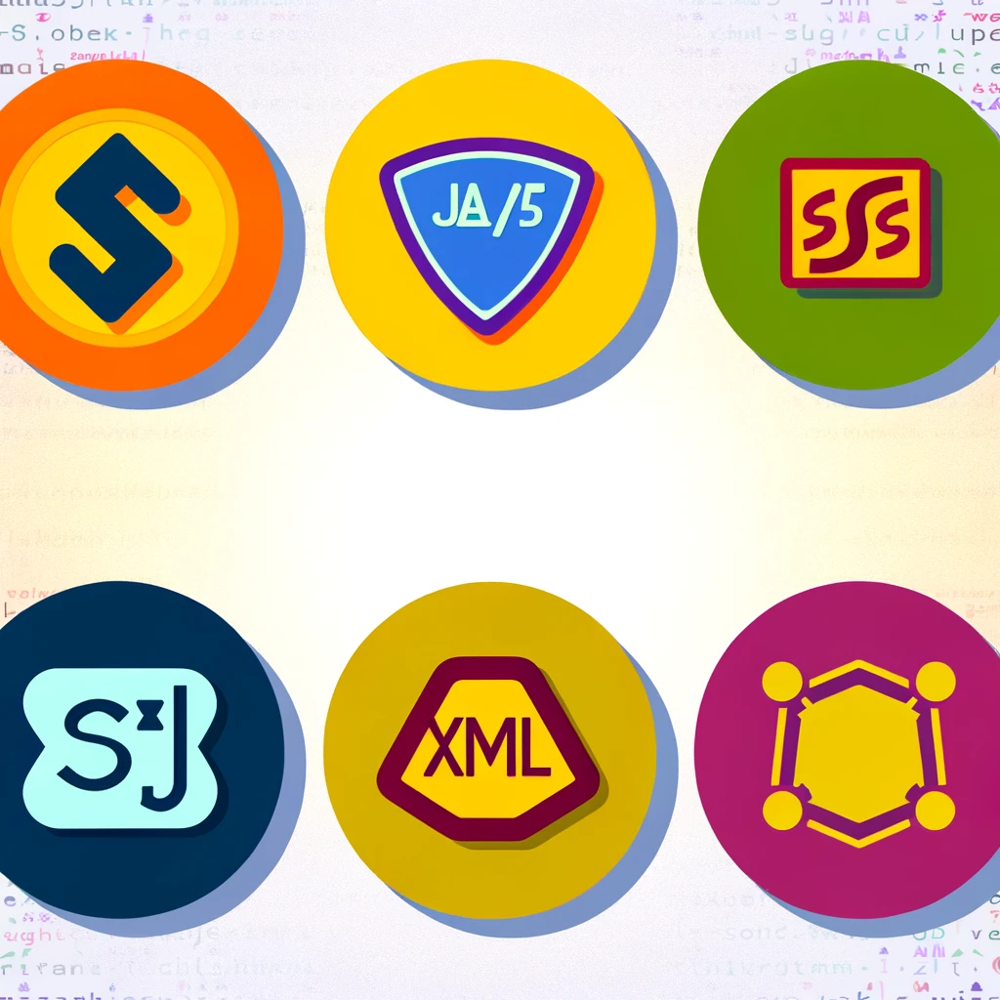

# Hola, soy Ariadna 👋

Estudiante apasionada de Desarrollo de Aplicaciones Multiplataforma 📱💻

```python
if aprendizaje_continuo:
    print("¡Sigamos programando!")

Sobre mí
🌱 Estoy aprendiendo Java, HTML, CSS, JavaScript, XML, SQL y Sistemas Informáticos con Bash Shell.
👩‍💻 Me encanta programar y crear aplicaciones que solucionen problemas reales.
🚀 Estoy emocionada por empezar a estudiar Swift y continuar expandiendo mis habilidades en desarrollo de software.
📖 En constante aprendizaje y exploración de nuevas tecnologías.




## Tecnologías que estoy aprendiendo:


¡Gracias por visitar mi perfil de GitHub!

¡Gracias por visitar mi perfil de GitHub!
